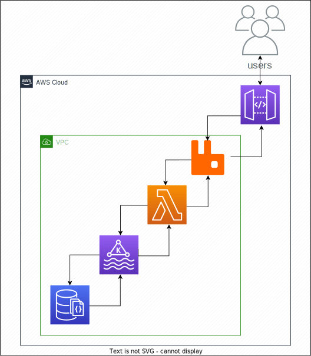

# Proof of concept for APPG
## part 1
### Solution Architecture

### Metrics for Components
#### [[+]](https://docs.newrelic.com/docs/infrastructure/amazon-integrations/aws-integrations-list/aws-lambda-monitoring-integration/) Lambda
* concurrentExecutions
* deadLetterErrors
* duration
* errors
* invocations
* iteratorAge
* throttles
#### [[+]](https://docs.newrelic.com/docs/infrastructure/amazon-integrations/aws-integrations-list/aws-api-gateway-monitoring-integration/) API Gateway
* CacheHitCount
* CacheMissCount
* Count
* IntegrationLatency
* Latency

#### [[+]](https://docs.newrelic.com/docs/apis/rest-api-v2/get-started/introduction-new-relic-rest-api-v2/) API RESTful
* JMV (APM)
* Health Checks Ports
  * Ports
  * Auth
  * Methods Response *(GET, POST, PUT, DELETE)*
*  Response Time
* Retries

#### [[+]](https://docs.newrelic.com/docs/infrastructure/host-integrations/host-integrations-list/kafka/kafka-integration/) Kafka
* number of brokers
* broker bytes
* messages per sec
* consumer lag
* tracking brokers

#### ZooKeeper JMX
* Quorum
* LocalPeer/RemotePeer
* LeaderElection
* Leader
* Follower
* ServerCnxn
* DataTree

#### [[+]](https://docs.newrelic.com/docs/infrastructure/host-integrations/host-integrations-list/rabbitmq-monitoring-integration/) RabbitMQ
* Total Used File Descriptors by Node
* Total Memory Usage by Node
* Consumers by Queue
* Consumer Message Utilization by Queue
* Total Messages by Queue
* Total Message Throughput by Queue
* Published Messages by Queue
* Published Messages Throughput by Queue

#### [[+]](https://docs.newrelic.com/docs/infrastructure/host-integrations/host-integrations-list/mongodb-monitoring-integration/) MongoDB
* collection.avgObjSizeInBytes
* collection.capped
* collection.count
* collection.indexAccesses
* collection.sizeInBytes
* collection.storageSizeInBytes
* commands.countFailedPerSecond
* commands.insertPerSecond
* connections.current
* connections.available
